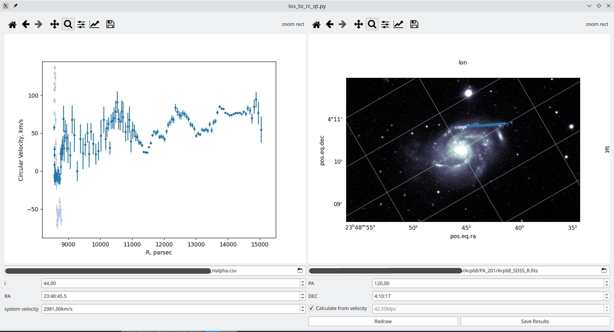
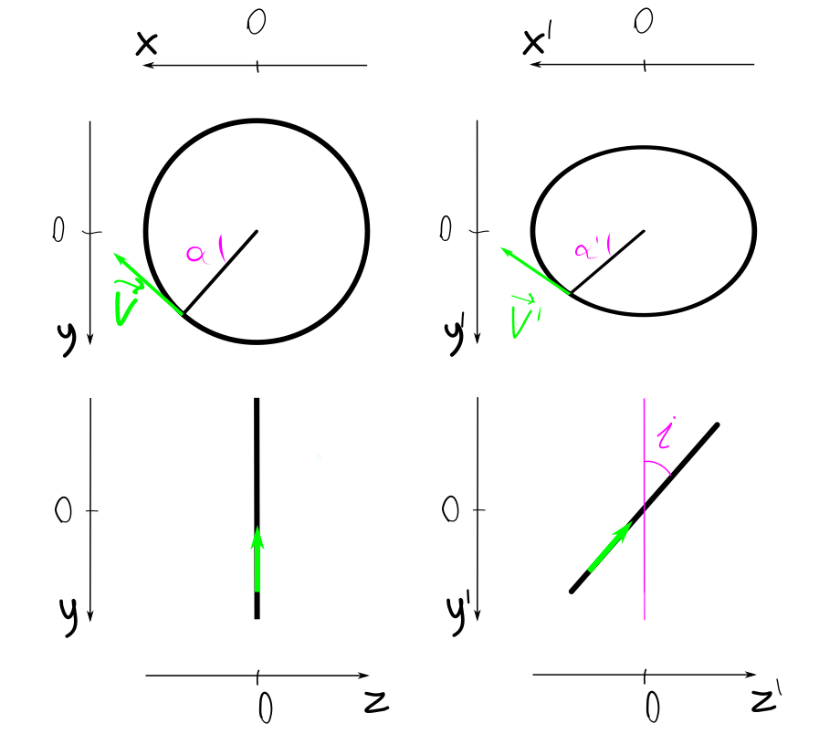

# los_to_rc
GUI for calculating galaxy rotation curves using known line-of-sight velocities.

## Installation
Currently, this software was only tested on Linux systems and Python 3.10.

First of all, you need to install the necessary packages:
 - numpy
 - matplotlib
 - pandas
 - astropy
 - PySide6

You can do it in any way you prefer, or use the command:

`pip install numpy matplotlib pandas astropy PySide6`

Then you can clone this repository in any folder and make the main script executable:

```
git clone https://github.com/CosmicHitchhiker/los_to_rc.git
cd los_to_rc
chmod a+x los_to_rc_qt.py
```

## Usage

 <p align="center">
  
</p>

To use this program one needs to prepare a CSV file with measured line of sight
velocities and coordinates of points at which those velocities were measured.
The CSV file should contain next columns:

 - _velocity_ : measured line of sight velocity (km/s)
 - _RA_ : Right Accession of every point (HH:MM:SS.SS - hour angle)
 - _DEC_ : Declination of every point (DD:MM:SS.SS - degrees)
 - _v_err_ : velocity error (km/s), OPTIONAL

Run the script:

`./los_to_rc.py`

Now you should fill in all of the fields at the bottom of the window.
 - **csv** (upper left) : full path to a CSV file with velocity and coordinates data.
 You can add several CSV files, in this case, their paths should be comma-separated.
 - **image** (upper right) : full path to a fits-file with an image of a galaxy you work with.
 - **i** : inclination angle (degrees), an angle between the picture plane and the plane of a galaxy disc.
 - **PA** : position angle of the major axis of a galaxy (degrees).
 In case of negative circular velocity values, you should add 180 to the value of PA.
 - **RA** : Right Acession of the center of a galaxy (hour angle).
 - **DEC** : Declination of the center of a galaxy (degrees).
 - **System velocity** : line of sight velocity of the center of a galaxy (km/s).
 - **Distance**: a distance to the galaxy (Mpc). You can check the *calculate from velocity* checkbox to
 calculate distance using formulae: D = V/70, where D is the distance, V is the system velocity
 and 70 km/s/Mpc is the Hubble constant.

 After that, you can push the *Redraw* button to plot the rotation curve and the image of a galaxy
 with the points of measured velocities on it.

 If you need to save the results, you can push the *Save Results* button. A separate
 dialog to save file will be opened for each CSV file from *csv* field. The resulting
 file is also a CSV file. It contains next columns:
 - _RA_ : Right Accession of every point (HH:MM:SS.SS - hour angle)
 - _DEC_ : Declination of every point (DD:MM:SS.SS - degrees)
 - _Circular_v_ : velocity of every point relative to the center of a galaxy assuming
 circular motion (km/s)
 - _Circular_v_err_ : error of circular_v (km/s)
 - _R_pc_ : distance from every point to the center of a galaxy, corrected by inclination angle (pc)
 - _R_arcsec_ : distance from every point to the center of a galaxy, corrected by inclination angle (arcsec)
 - _mask1_ and _mask2_ : boolean values. _mask1_ is True if the point is on one side of the galaxy's minor axis
 and _mask2_ is True if it is on the other side. There may be some points that have both _mask1_ and _mask2_ values False.
 That means that either circular_v_err is too big (>200km/s) or the point is too close to the minor axis.

 ## Algorithm of the calculations

 ### Coordinates definition

 <p align="center">
  
</p>

 I define the *observed* three-dimensional cartesian coordinate system with the center in the galaxy center:
  - x'-axis matches the major axis
  - y'-axis matches the minor axis
  - z'-axis matches the line of sight

Then I define the *galaxy* coordinate system, in which I take into account the inclination (*i*) of the
galaxy plane to the picture plane:
 - x-axis still matches the major axis ($x = x'$)
 - y-axis matches the minor axis, but the y-coordinate stretches due to the inclination of
  the galaxy ($y = y' / \cos{i}$)
 - z-axis matches the line of sight, but the z-coordinate also stretches ($z = z' / \sin{i}$)

Let's consider a point in the galaxy plane at the distance R from the center of the galaxy with an angle between
its radius-vector and the x-axis (in the galaxy plane) equal $\alpha$.
Its coordinates in the *galaxy* coordinate system are:
 - $x = R \cdot \cos{\alpha}$
 - $y = R \cdot \sin{\alpha}$
 - $z = 0$

If we assume the circular motion of this point, its velocity vector is perpendicular to its
radius-vector. If the modulus of its velocity vector is *v*, 
coordinates of the velocity vector in the *galaxy* coordinate system are:
 - $v_x = v \cdot \sin{\alpha}$
 - $v_y = v \cdot \cos{\alpha}$
 - $v_z = 0$

The coordinates of those vectors in the *observed* coordinate system are:
 - $x'=x$
 - $y'=y\cdot \cos i$ 
 - $z'=y\cdot \sin i$
 - $v'_x = v_x$
 - $v'_y=v_y\cdot \cos i$
 - $v'_z=v_y\cdot \sin i$

### Calculation of the rotation curve

$x'$ and $y'$ can be directly measured if we know the position angle of the major axis of a galaxy
and the coordinates of its center. I use *astropy* python package for this purpose.

$`v'_z`$ can be calculated if we know line-of-sight velocity of the point $v_{los}$ and the velocity
of the center of the galaxy $v_{sys}$: $`v'_z = v_{los} - v_{sys}`$

To calculate the rotation curve one needs to obtain $v$ and $R$ values of the set of points:

$v_y=v'_z/\sin{i}$

$y = y'/\cos{i}$

$tg {\alpha} = y/x = y'/(x' \cdot \cos{i})$

$v = v_y/\cos{\alpha} = v'_z/(\sin{i} \cdot \cos{\alpha})$

$R = \sqrt{x^2 + y^2} = \sqrt{x'^2 + y'^2/\cos^2 i}$


